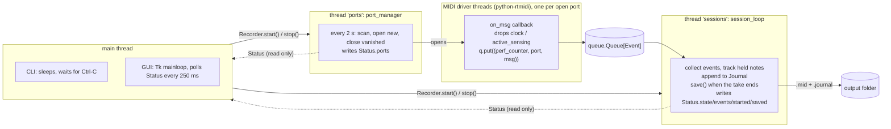
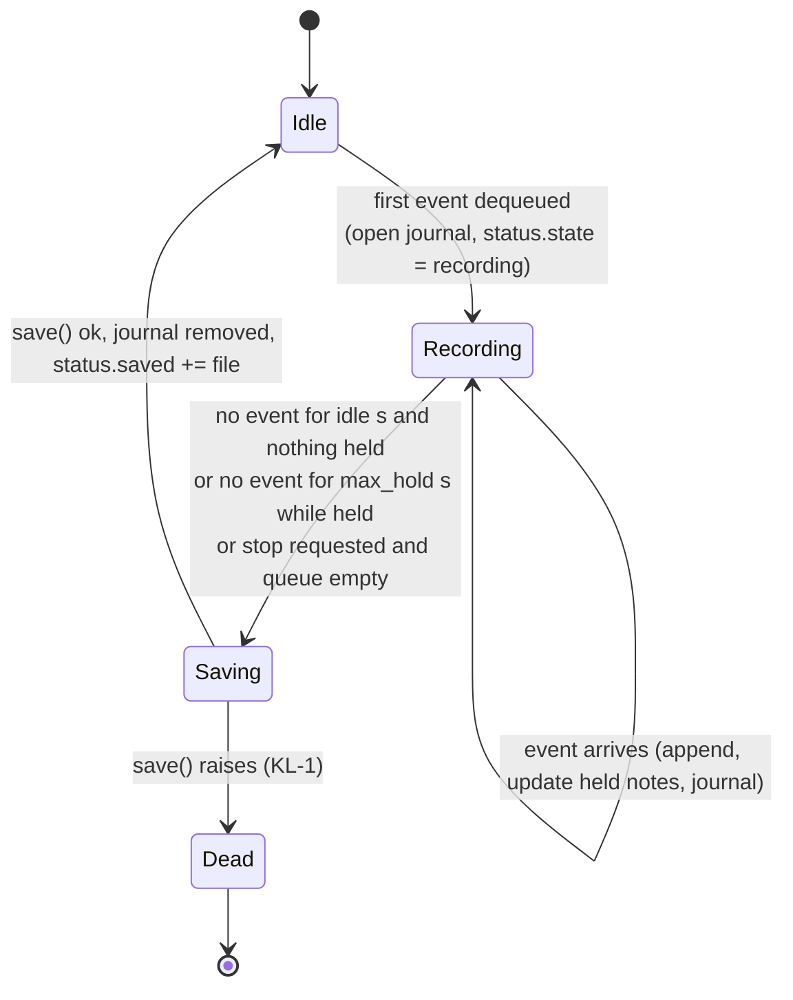

# midi-recorder: specification and handover

| | |
|---|---|
| Project | `midi-recorder` (repository `recording-midi-data`) |
| Describes | version **0.1.1** (`__version__` in `midi_recorder.py`) |
| Written | 2026-10-05 |
| Repository | https://github.com/maarten-boot/recording-midi-data |
| License | MIT |
| Owner | Maarten Boot |

This document describes what the program does, how it is built, how it is tested and released, and where it is known to be weak.
It is written so that someone who has never seen the code can maintain it. Behaviour described here is **frozen by tests** wherever a test is named (see section 9); where it is not, the text says so.

## 0. Orientation: read this first

**What it is.** A small Python program that records everything arriving on the computer's MIDI inputs into standard `.mid` files, with no user action: the first event starts a recording, silence ends it, the file is named after the start time. A command line program (`midi-recorder`) and a status window (`midi-recorder-gui`) share one engine.

**Where the code is.** Two modules in the repository root, no package:

| File | Lines | Role |
|---|---|---|
| `midi_recorder.py` | ~490 | Everything except the window: ports, sessions, files, journal, logging, CLI. |
| `midi_recorder_gui.py` | ~140 | The tkinter window. Uses `midi_recorder.Recorder` and `Status`, nothing else. |

**The five things most worth knowing**

1. There are two worker threads (`ports`, `sessions`) joined by one `queue.Queue`. A third kind of thread, the MIDI driver's callback thread, only ever calls `queue.put`. See section 4.
2. Event times come from `time.perf_counter()` at the moment the driver callback runs. They are *not* the device's timestamps.
3. While a take is recorded, every event is also appended to a **journal** file. A clean save deletes it; a crash leaves it, and the next start turns it into a `.mid`. See section 5.2.
4. `mido` has no type information, so the repository ships a minimal stub in `stubs/mido/`. `mypy --strict` depends on it.
5. **Known serious weakness (KL-1):** if writing the `.mid` fails (disk full, permissions), the session thread dies, the program keeps running and the window still says "Ready", but nothing is recorded any more. The journal keeps the data. See section 11.

**How to get going**

```
make check        # creates .venv, then ruff + ruff format --check + mypy --strict + pytest
xvfb-run make coverage   # (headless Linux) or plain `make coverage` on a desktop: 100 % line and branch coverage
make run ARGS="-o ~/midi"
make run-gui ARGS="-o ~/midi"
```

## 1. Purpose, scope, non-goals

**Purpose.** Never lose a practice session on a MIDI keyboard: leave the recorder running; whatever is played ends up in a dated file that opens in any DAW.

**In scope**

- Record every MIDI event from every input, including pedals, aftertouch (channel and polyphonic) and pitch bend.
- Start and stop by themselves; name files by start time.
- Run on Linux (Debian, Ubuntu, Fedora), Windows 10/11 and macOS.
- Show, in a small window, that it is alive, what it listens to and what it has saved.
- Survive crashes with at most about one second of data at risk (power loss) or none (process crash).

**Non-goals**

- No live display of notes, no piano roll, no playback (use a DAW).
- No editing, quantizing or merging of recordings.
- No MIDI output, thru or routing.
- No network, no cloud, no configuration file.

## 2. Quick facts

| | |
|---|---|
| Language | Python 3.10 to 3.12 (`requires-python >=3.10`) |
| Runtime dependencies | `mido>=1.3`, `python-rtmidi>=1.5.8` |
| GUI dependency | `tkinter` (not a pip package; `python3-tk` on Debian/Ubuntu, `python3-tkinter` on Fedora) |
| Console scripts | `midi-recorder`, and (gui-script) `midi-recorder-gui` |
| Build backend | `hatchling`, version read from `__version__` in `midi_recorder.py` |
| Wheel contents | `midi_recorder.py`, `midi_recorder_gui.py`, metadata, `LICENSE` |
| Dev tools | `ruff`, `mypy --strict`, `pytest`, `pytest-cov`, `build`, `twine` (all in the `dev` extra) |
| Tests | 114, about 13 s, 100 % line and branch coverage (section 9) |
| Not supported | Python 3.13: `python-rtmidi` publishes no wheels for it, pip would have to compile it |

## 3. Functional specification

Requirement IDs are stable; "Frozen by" names the tests that fail if the behaviour changes (file `tests/test_*.py`, abbreviated to the part after `tests/`).

### 3.1 Takes (recording sessions)

| ID | Requirement | Frozen by |
|---|---|---|
| FR-1 | A take **starts** with the first event from any input, of any message type except the filtered ones (FR-8). | `test_sessions::test_a_take_ends_after_the_idle_time` |
| FR-2 | A take **ends** when `idle` seconds (default 30) have passed since the last event arrived **and** no note is held and no sustain pedal is down. | same; `test_sessions::test_a_take_stays_open_while_a_note_or_the_pedal_is_held` |
| FR-3 | While anything is held, the limit is `max_hold` seconds (default 120) instead of `idle`. This lets a long held chord stay in the take, and bounds a stuck note. | `test_sessions::test_a_take_stays_open_while_a_note_or_the_pedal_is_held`, `test_sessions::test_max_hold_ends_a_take_with_a_stuck_note` |
| FR-4 | "Held" means: a `note_on` with velocity > 0 without a matching `note_off` (or `note_on` velocity 0), per (port, channel, pitch); or controller 64 (sustain) with value >= 64, per (port, channel). Other controllers (66 sostenuto, 67 soft pedal) and "all notes off" do **not** count. | `test_events_and_files::TestHoldState::*` |
| FR-5 | After a take is saved, the next event starts a new take. | `test_sessions::test_a_new_event_after_a_take_starts_the_next_take` |
| FR-6 | Stopping (Ctrl-C, closing the window, `Recorder.stop()`) saves the take in progress, including events that were already queued. Stopping while idle writes nothing. | `test_sessions::test_stop_saves_the_take_in_progress_including_queued_events`, `test_sessions::test_stop_while_idle_writes_nothing`, `test_ports_and_recorder::TestRecorder::test_stop_saves_the_take_in_progress` |
| FR-7 | The output folder is created if missing, including parents. | `test_sessions::test_the_output_folder_is_created`, `test_cli::TestPrepare::test_creates_the_folder_and_logs_into_it_by_default` |

### 3.2 Inputs

| ID | Requirement | Frozen by |
|---|---|---|
| FR-8 | Only `clock` and `active_sensing` messages are dropped. Everything else the backend delivers is recorded (notes, controllers, pedals, aftertouch, poly aftertouch, pitch bend, program change, song position, sysex, ...). | `test_ports_and_recorder::TestPortManager::test_callback_queues_events_with_port_name_and_drops_realtime_noise`, `test_events_and_files::TestSave::test_messages_survive_unchanged_and_the_input_is_not_modified` |
| FR-9 | All input ports are opened, except those whose name contains `midi through` or `rtmidi` (case-insensitive). | `test_ports_and_recorder::TestPortManager::test_opens_real_inputs_and_skips_loopbacks` |
| FR-10 | Ports are rescanned every 2 s. A new port is opened, a vanished port is closed. A port that comes back is opened again. | `test_ports_and_recorder::TestPortManager::test_hot_plug_opens_new_and_closes_vanished_inputs`, `test_a_replugged_input_is_opened_again` |
| FR-11 | If the port scan itself fails, the ports already open are kept, and the failure is logged once per outage. | `test_ports_and_recorder::TestPortManager::test_scan_failure_is_logged_once_per_outage_and_open_inputs_are_kept` |
| FR-12 | A port that cannot be opened is retried at every rescan but logged once; if it disappears and returns, it is reported again. | `test_open_failure_is_logged_once_per_port_but_retried`, `test_a_failing_port_that_disappears_is_forgotten` |

### 3.3 Output files

| ID | Requirement | Frozen by |
|---|---|---|
| FR-13 | File name `YYYY-MM-DD_HH-MM-SS.mid`, local time of the start of the take. No colons (Windows). | `test_events_and_files::TestSave::test_filename_comes_from_the_start_time_and_suffix`, `test_events_and_files::test_file_stem_and_constants` |
| FR-14 | Standard MIDI file **type 1**, 1000 ticks per beat, tempo 1 000 000 us per beat, so **1 tick = 1 ms** and the file plays in real time. | `test_events_and_files::TestSave::test_ticks_are_milliseconds_relative_to_the_first_event`, `test_playing_length_equals_recorded_time` |
| FR-15 | Track 0 holds only the tempo. Then **one track per input port**, in order of first event, each starting with a `track_name` of the port name and ending with `end_of_track`. | `test_events_and_files::TestSave::test_one_track_per_port_in_order_of_first_event`, `test_tempo_track_and_end_of_track_markers` |
| FR-16 | The first event of the take is at tick 0. Delta times are differences of *rounded absolute* ticks, so rounding error never accumulates. | `test_events_and_files::TestSave::test_rounding_never_accumulates` |
| FR-17 | Messages are written unchanged; the caller's message objects are not modified. | `test_events_and_files::TestSave::test_messages_survive_unchanged_and_the_input_is_not_modified` |

### 3.4 Crash safety

| ID | Requirement | Frozen by |
|---|---|---|
| FR-18 | While a take is recorded, each event is appended to `<outdir>/<same stem>.journal` and flushed to the OS immediately; `fsync` at most once per second. | `test_journal::TestFormat::test_header_and_event_lines`, `test_journal::TestSync::test_fsync_is_throttled`, `test_sessions::test_the_journal_mirrors_the_take_while_it_is_recorded` |
| FR-19 | After a successful save the journal is deleted. | `test_sessions::test_the_journal_mirrors_the_take_while_it_is_recorded`, `test_midi_recorder::test_session_loop_saves_after_idle` |
| FR-20 | On `Recorder.start()`, every `*.journal` in the output folder is converted to a `.mid` named from the journal's header, then deleted. A journal without events is deleted. A journal whose header is unreadable is left in place and reported. | `test_journal::TestRecovery::*`, `test_midi_recorder::test_recovery_discards_empty_and_keeps_unreadable_journals`, `test_ports_and_recorder::TestRecorder::test_start_recovers_journals_left_by_a_crash` |
| FR-21 | If the recovered name already exists, `_recovered` is added to the stem; an existing file is never overwritten by the first recovery. | `test_midi_recorder::test_recovery_does_not_overwrite_existing_file` |
| FR-22 | Damaged journal lines (for example a write cut off by the crash) are skipped, each with a warning. | `test_journal::TestLoad::test_damaged_lines_are_skipped_with_a_warning_each` |
| FR-23 | A journal that cannot be written (folder missing, disk full) never stops the recording; it is logged once. | `test_journal::TestFailures::*` |
| FR-24 | If saving fails, the journal stays for the next start. | `test_sessions::test_a_failed_save_leaves_the_journal_and_the_error_propagates`, `test_journal::TestRecovery::test_a_failed_save_keeps_the_journal_for_the_next_start` |

### 3.5 Logging

| ID | Requirement | Frozen by |
|---|---|---|
| FR-25 | Logger `midi_recorder`; output to stderr and, by default, to `<outdir>/midi_recorder.log`, rotated at 1 MB with 3 backups; line format `YYYY-MM-DD HH:MM:SS LEVEL message`. | `test_cli::TestLogging::*`, `test_cli::TestPrepare::*` |
| FR-26 | `--log-level` (default INFO), `--log-file PATH`, `--no-log-file`. Calling the set-up twice does not duplicate output. | `test_cli::TestOptions::*`, `test_cli::TestLogging::test_calling_it_twice_does_not_duplicate_output` |

### 3.6 Command line and window

| ID | Requirement | Frozen by |
|---|---|---|
| FR-27 | `midi-recorder --list` prints the input ports, one per line, *unfiltered*; with no ports it prints a note on stderr and exits 0; if the backend is unusable it prints `error:` and a `hint:` on stderr and exits 1, with no traceback. | `test_cli::TestListPorts::*` |
| FR-28 | `midi-recorder` runs until Ctrl-C, then stops the recorder (saving the current take) and exits 0. The recorder is stopped even if something else raises. | `test_cli::TestMain::*` |
| FR-29 | The window shows RECORDING (events, elapsed time), or Ready (with the silence limit), or "No MIDI input found"; the open inputs; the saved files newest first; the output folder; an "Open folder" button. Closing it saves the current take. | `test_gui::TestWindow::*`, `test_gui::TestMain::test_window_lifecycle_starts_and_stops_the_recorder`, `test_gui::TestOpenFolder::*` |
| FR-30 | Without a display the GUI prints `error: cannot open a window: ...` and exits 1 *before* starting the recorder. | `test_gui::TestMain::test_no_display_gives_a_clean_error_and_starts_nothing` |
| FR-31 | The list boxes are rewritten only when their content changes, so a user's selection survives the 250 ms refresh. | `test_gui::TestWindow::test_lists_are_only_rewritten_when_their_content_changes` |

## 4. Architecture

### 4.1 Components and threads



`Recorder` (in `midi_recorder.py`) owns the queue, the stop flag, the `Status` object and the two worker threads. The CLI and the GUI are thin: they build a `Recorder`, call `start()`, wait, and call `stop()`.

**Event.** `Event = tuple[float, str, mido.Message]`: `(time.perf_counter() at arrival, port name, message)`.

**Stop protocol.** One `threading.Event`. Both workers poll it: the session loop every `POLL_SECONDS` (0.2 s), the port manager through `stop.wait(RESCAN_SECONDS)`, which returns at once when set. `Recorder.stop()` sets it and joins each thread with a 5 s timeout (a thread still alive is logged as a warning). Both threads are daemon threads so a hung one cannot keep the process alive. The session loop, once stopped, still consumes everything already in the queue before saving.

**`Status` ownership.** A plain dataclass shared with the UI, with **no lock**, because every field has one writer thread and the UI only reads whole values (tuples are replaced, never mutated):

| Field | Written by |
|---|---|
| `state`, `events`, `started` | `sessions` thread |
| `saved` (oldest first, at most 50) | `sessions` thread; the main thread once, in `Recorder.start()`, before the threads exist |
| `ports` | `ports` thread |

A `Recorder` is **single use**: after `stop()` the stop flag stays set.

### 4.2 Take life cycle



Pseudocode of `session_loop` (the real code is about 60 lines):

```
while not stop:
    first = q.get(timeout=0.2) or continue
    started = datetime.now()                     # local, naive; taken after dequeue
    journal = Journal(<stem of started>.journal, t0 = first.time); journal.append(first)
    try:
        while not (stop and q.empty()):
            limit = max_hold if held_notes_or_pedal else idle
            remaining = limit - (perf_counter() - events[-1].time)   # measured from the last event's ARRIVAL
            if remaining <= 0: break
            item = q.get(timeout=min(remaining, 0.2)) or continue
            events.append(item); update held notes; journal.append(item)
    finally:
        journal.close(); path = save(events); journal.remove(); status.saved += path
```

### 4.3 Module reference: `midi_recorder.py`

| Name | Kind | Contract |
|---|---|---|
| `__version__` | str | Single source of the package version. |
| `Event` | type alias | See 4.1. |
| `Status` | dataclass | Live state for a UI (4.1). `elapsed_text(now)` returns `HH:MM:SS` since `started`, `""` when not recording, and never negative. |
| `HoldState` | class | `update(port, msg)` and property `active`; rules in FR-4. |
| `file_stem(started)` | func | `YYYY-MM-DD_HH-MM-SS`. |
| `save(events, started, outdir, suffix="")` | func | Writes the file of FR-13 to FR-17 and returns its path. `events` must not be empty. |
| `Journal(path, started, t0)` | class | `append(event)`, `close()`, `remove()`. Never raises for I/O problems (FR-23). |
| `load_journal(path)` | func | Returns `(started, events)` with times as elapsed seconds. Raises `ValueError` if there is no valid header. |
| `recover_journals(outdir)` | func | FR-20, FR-21. Returns the files written. |
| `session_loop(q, outdir, idle, max_hold, status=None, stop=None)` | func | 4.2. Returns only when `stop` is set. |
| `port_manager(q, stop, status=None)` | func | FR-9 to FR-12. |
| `Recorder(outdir, idle=30, max_hold=120)` | class | `start()` creates the folder, recovers journals, starts the threads; `stop()`; attribute `status`. |
| `list_ports()` | func | FR-27. Returns the exit code. |
| `add_common_arguments(ap)`, `prepare(args)` | funcs | Options shared by CLI and GUI; `prepare` creates the folder and configures logging. |
| `setup_logging(level, log_file)` | func | FR-25. |
| `main()` | func | The CLI entry point. |

Constants (all module level, all overridable by tests): `SKIP_TYPES`, `SKIP_PORT_PARTS`, `RESCAN_SECONDS=2.0`, `POLL_SECONDS=0.2`, `TICKS_PER_BEAT=1000`, `DEFAULT_TEMPO=1_000_000`, `TICKS_PER_SECOND` (derived, 1000.0), `IDLE_TIME=30.0`, `MAX_HOLD=120.0`, `JOURNAL_SUFFIX=".journal"`, `JOURNAL_SYNC_SECONDS=1.0`, `JOURNAL_VERSION=1`, `RECENT_FILES=50`, `LOG_*`.

`midi_recorder_gui.py`: `App(root, recorder)` builds the window and re-arms itself with `root.after(250, ...)`; `open_folder(path)` chooses `os.startfile` (Windows), `open` (macOS) or `xdg-open`; `main()` creates the `Tk` root **first** (so a missing display fails before anything starts), then `prepare`, `Recorder.start`, `mainloop`, and `Recorder.stop` in a `finally`.

## 5. Data formats

### 5.1 `.mid` file

Type 1, `ticks_per_beat = 1000`.

```
track 0   set_tempo(1 000 000), end_of_track
track 1   track_name "<port of the first event>", events..., end_of_track
track 2   track_name "<next port>", ...                        (only with more than one input)
```

Two real recordings made with a virtual keyboard during development (6.15 s with 120 events, and 5.16 s with 60 events) each have one note track, named `Virtual Keyboard:Virtual Keyboard 128:0`.

### 5.2 Journal

UTF-8, one JSON value per line. Name: same stem as the `.mid`, suffix `.journal`.

```
{"version": 1, "started": "2026-10-05T09:40:04.877755"}
[0.0, "Piano 20:0", "B0 40 7F"]
[0.150185, "Piano 20:0", "90 3C 50"]
```

Line 1 is the header (`version` is written but not checked when reading). Every further line is `[seconds since the first event, rounded to microseconds, port name, message as upper-case hex bytes separated by spaces]`. Reading uses `mido.Message.from_hex`. Frozen by `test_journal::TestFormat::*`.

Durability: flushed to the OS after every event (survives a killed process); `fsync` at most once a second (a power cut can lose the last second).

### 5.3 Log

```
2026-10-05 12:33:33 INFO recording started
2026-10-05 12:34:08 INFO saved /home/u/midi/2026-10-05_12-33-33.mid (60 events)
```

| Level | Messages |
|---|---|
| INFO | `midi recorder active, writing to <dir> (Ctrl-C to quit)`, `listening on: <port>`, `input gone: <port>`, `recording started`, `saved <path> (<n> events)`, `discarding empty journal <name>`, GUI: `midi recorder (GUI) active, ...` |
| WARNING | `port scan failed: <err>`, `cannot open <port>: <err>`, `cannot write journal ...`, `journal write failed ...`, `recovered <mid> from <journal> (<n> events)`, `<journal> line <n> skipped: <err>`, `thread <name> did not stop in time`, `cannot open folder ...` |
| ERROR | `cannot recover <journal>: <err> (left in place)` |

## 6. Interfaces

### 6.1 Command line

`midi-recorder [options]`; `midi-recorder-gui [options]` takes the same options except `--list`.

| Option | Default | Notes |
|---|---|---|
| `-o`, `--outdir` | `.` | Created if missing. Holds `.mid`, `.journal`, and by default the log. |
| `--idle` | `30.0` | Seconds of silence that end a take (FR-2). |
| `--max-hold` | `120.0` | Silence limit while something is held (FR-3). |
| `--log-level` | `INFO` | `DEBUG`, `INFO`, `WARNING`, `ERROR`, any case. |
| `--log-file` | `<outdir>/midi_recorder.log` | |
| `--no-log-file` | off | stderr only. |
| `--list` | | CLI only. |

There are no environment variables and no config file. Values are **not validated** (KL-6).

**Exit codes.** `0` normal exit or Ctrl-C; `1` backend error with `--list`, or no display for the GUI; `2` command line syntax error (argparse). An unhandled exception gives Python's usual traceback and exit code 1.

**Signals.** SIGINT/Ctrl-C is handled (the take is saved). SIGTERM, SIGKILL, closing a Windows console, and power loss are not handled; the journal covers them at the next start.

### 6.2 Window

Title `MIDI recorder`, minimum 420 x 360. Strings and colours are constants at the top of `midi_recorder_gui.py`:

| State | Text | Colour |
|---|---|---|
| recording | `● RECORDING` and `<n> events   HH:MM:SS` | red `#c0392b` |
| ready (at least one input) | `Ready – waiting for MIDI`, `Recording stops after <idle> s of silence` | green `#1e8449` |
| no input | `No MIDI input found`, `Connect a MIDI device; it is picked up automatically` | amber `#b9770e` |

On Windows the gui-script runs without a console, so `sys.stderr` is `None`. Logging is silent about that and the file log keeps working (`test_cli::TestLogging::test_a_missing_stderr_is_harmless`).

## 7. Platform notes

| Platform | Backend | Notes |
|---|---|---|
| Linux | ALSA sequencer through python-rtmidi | Needs `/dev/snd/seq`. Normally several programs can read the same keyboard, so a DAW can run alongside. Port names contain `client:port` numbers that can change after replugging: that simply looks like a new port. `Midi Through` is skipped. |
| Windows 10/11 | WinMM | **One program at a time** can usually open a given MIDI input. Close the DAW or route through a loopback driver such as loopMIDI. |
| macOS | CoreMIDI | Expected to work; tested only by the unit tests in CI, never with a real keyboard. |

Python 3.10 is scheduled to reach end of life in October 2026. Raising `requires-python` is possible, but check `python-rtmidi` wheels first.

## 8. Build, packaging, release

### 8.1 Repository layout

```
.github/workflows/ci.yml        checks on 3 systems x Python 3.10 and 3.12, plus a package build
.github/workflows/release.yml   PyPI release (trusted publishing)
.gitignore  LICENSE  README.md  SPECIFICATIONS.md
Makefile                        every developer task, inside .venv
pyproject.toml                  metadata, hatch, ruff, mypy, coverage, pytest
midi_recorder.py  midi_recorder_gui.py
stubs/mido/__init__.pyi  stubs/mido/ports.pyi   typing stub for the part of mido that is used
tests/                          conftest.py, helpers.py, test_*.py (section 9)
```

### 8.2 Makefile

All tools are run as `$(VBIN)/tool`, i.e. from `.venv`, **never** from `PATH`. (A system `twine` 5.0 on Ubuntu 24.04 once shadowed the venv's twine 7 and caused `InvalidDistribution: Metadata is missing required fields`.)

| Target | Does |
|---|---|
| `help` (default) | lists targets |
| `venv` | creates `.venv` and installs `-e ".[dev]"`; rebuilt when `pyproject.toml` changes |
| `lint`, `format`, `format-check`, `typecheck`, `test` | the individual tools |
| `check` | lint + format-check + typecheck + test (writes nothing) |
| `coverage` | `pytest --cov`, fails under 95 %; GUI tests need a display |
| `all` | `distclean venv lint format format-check typecheck test`; **runs `ruff format`, so it rewrites files** |
| `build` | `check`, then `python -m build`, then `twine check dist/*` |
| `testpypi` | `build`, then upload to TestPyPI (`~/.pypirc` section `mboot_testpypi`) |
| `pypi` | `pypi-guard`, `build`, shows `dist/`, asks you to **retype the version**, then uploads (section `mboot_pypi`) |
| `pypi-guard` | fails unless the git tree is clean (untracked files count) and `HEAD` carries tag `v<version>` or `<version>` |
| `run`, `run-gui` | start the programs (`ARGS="..."`) |
| `clean`, `distclean` | remove caches and `dist`, and (distclean) `.venv` |

Do not make `build` depend on `all`: `all` deletes the venv in the middle of the run and make does not recreate it.

### 8.3 Packaging

`hatchling` builds a wheel with the two modules and an sdist that also contains `tests/`, `stubs/`, `Makefile`, `README.md`, `SPECIFICATIONS.md`, `LICENSE`. The version comes from `__version__`. Hatchling 1.32 writes core metadata 2.5, which old twine versions cannot read (measured in a venv that also had `pkginfo` 1.10: twine 5.x and 6.0 fail with "missing required fields", 6.1 and 6.2 with "'2.5' is not a valid metadata version", 7.x works). If an old uploader must be supported, add `core-metadata-version = "2.4"` under both `[tool.hatch.build.targets.wheel]` and `[tool.hatch.build.targets.sdist]`. Whether the real PyPI accepts metadata 2.5 was **not verified** for this project (see open item OI-6).

### 8.4 Continuous integration (`ci.yml`)

Triggers: push to `main`, pull requests, manual. Matrix: `ubuntu-latest`, `windows-latest`, `macos-latest` x Python `3.10`, `3.12` (3.13 is excluded on purpose, see section 2). Steps: install `-e ".[dev]"`; `ruff check`; `ruff format --check`; `mypy`; `pytest`. A separate `package` job builds the sdist and wheel, runs `twine check`, and uploads `dist/` as an artifact. The workflows call the tools directly (no `make`) so Windows needs no GNU make.

GUI window tests skip themselves when there is no display, so on the Linux runner only the display-independent GUI tests run (`pytest.skip`, not a failure). Whether the Windows and macOS runners provide a display for Tk was not observed.

### 8.5 Release (`release.yml`)

```
bump __version__ -> commit -> push -> GitHub: create release with tag v<version> -> workflow runs
```

Jobs: `build` (ruff, mypy, pytest, build, `twine check --strict`, and, for a release event, a check that the tag equals `v<__version__>` or `<__version__>`); `publish-pypi` (only on a release; environment `pypi`); `publish-testpypi` (only on a manual run; environment `testpypi`, `skip-existing`). Only the publish jobs have `id-token: write`.

**One-time setup (not yet done at the time of writing):** on both pypi.org and test.pypi.org add a *pending trusted publisher* with project `midi-recorder`, owner `maarten-boot`, repository `recording-midi-data`, workflow `release.yml`, environment `pypi` (PyPI) or `testpypi` (TestPyPI); and create the two environments in the GitHub repository settings (optionally with yourself as required reviewer for `pypi`).

**Action pins.** All actions are pinned to full commit SHAs, with the version in a comment:

| Action | Version | Commit |
|---|---|---|
| `actions/checkout` | v7.0.1 | `3d3c42e5aac5ba805825da76410c181273ba90b1` |
| `actions/setup-python` | v7.0.0 | `5fda3b95a4ea91299a34e894583c3862153e4b97` |
| `actions/upload-artifact` | v7.0.1 | `043fb46d1a93c77aae656e7c1c64a875d1fc6a0a` |
| `actions/download-artifact` | v8.0.1 | `3e5f45b2cfb9172054b4087a40e8e0b5a5461e7c` |
| `pypa/gh-action-pypi-publish` | v1.14.2 | `dc37677b2e1c63e2034f94d8a5b11f265b73ba33` |

Pins do not update themselves (open item OI-5). Neither workflow has been run on GitHub from the environment this was written in; they were linted with `actionlint`.

## 9. Testing

### 9.1 Strategy

The aim of the suite is to **freeze behaviour** so the code can be changed safely. It needs no MIDI hardware: `tests/helpers.py` provides `FakeBackend` and `FakePort`, which replace `mido.get_input_names` and `mido.open_input` (fixture `fake_backend`, which also shortens the rescan interval to 20 ms). `tests/conftest.py` adds `log_records` to capture what the logger emits.

| File | Tests | Freezes |
|---|---|---|
| `test_events_and_files.py` | 20 | `HoldState`, `Status`, constants, `save()` and the `.mid` layout |
| `test_journal.py` | 17 | journal format, fsync throttle, failure handling, loading, recovery |
| `test_sessions.py` | 12 | `session_loop`: start, end, hold, max-hold, stop, journal, failed save |
| `test_ports_and_recorder.py` | 16 | `port_manager` (hot plug, failure logging) and `Recorder` end to end |
| `test_cli.py` | 20 | options, logging set-up, `prepare`, `list_ports`, `main` |
| `test_gui.py` | 14 | window states and lists, GUI `main`, `open_folder` branches |
| `test_midi_recorder.py` | 15 | the original tests, kept; some overlap with the newer files |

Total **114** (20 + 17 + 12 + 16 + 20 + 14 + 15).

### 9.2 Running

```
make test                       # pytest
xvfb-run make coverage          # headless Linux; on a desktop, plain `make coverage`
.venv/bin/pytest tests/test_sessions.py -k idle
```

Result when this document was written: 114 passed in about 13 s; coverage **100 %** of 417 statements and 86 branches (the `if __name__ == "__main__":` lines are excluded). On a machine **without a display**, 9 GUI tests skip and total coverage drops to about 85 %, which is below the `fail_under = 95` threshold and makes `make coverage` fail; that is expected, use a display or `xvfb-run`.

### 9.3 Timing-sensitive tests

Several tests use real threads and short sleeps (idle 0.1 to 0.3 s, waits up to 5 s). Margins are generous; the full suite was run repeatedly without a failure. If a test is flaky on a very slow CI machine, raise the sleep margins in `test_sessions.py` first (`test_a_take_stays_open_while_a_note_or_the_pedal_is_held` sleeps 0.6 s against a 0.1 s idle time).

### 9.4 How good is the suite? (one-off check)

20 deliberate mutations of `midi_recorder.py` were applied one at a time (sustain threshold, velocity-0 release, hold limit, tick rounding, journal removal, journal flush, skipped message types, loopback filter, log-once rules, port closing, queue drain on stop, recovery naming, file name format, tempo track, one track per port, thread joining, recovery reporting, `--list` error handling, default idle). **All 20 were caught.** This was done by hand with a throw-away script and is not part of the repository.

### 9.5 Not covered

- Real MIDI hardware, the OS MIDI drivers and `python-rtmidi` itself.
- Windows and macOS behaviour (CI runs the same tests there; not observed).
- Signals (SIGTERM), and a real `kill -9`: this was tried once by hand with a fake port (all 7 events recovered), not as an automated test.
- Very long takes, memory growth, high event rates.
- The real Tk event loop beyond what the tests drive (`refresh`, `close`, `main` with a quick `mainloop`).

### 9.6 Manual acceptance checklist for real hardware

Do this once on the real USB piano, on each OS that matters, with `--idle 5`:

1. `midi-recorder --list` shows the piano.
2. Play some notes **with the sustain pedal and aftertouch** (if the keyboard has it); stop; wait 5 s; open the new `.mid` in a DAW: notes, pedal (CC 64) and pressure are all there, timing matches.
3. Hold the pedal down without playing for longer than 5 s: the take must stay open; release it: the take ends 5 s later.
4. Unplug and replug the piano: log shows `input gone` then `listening on`, and the next take records.
5. Start a take and `kill -9` the process: the `.journal` stays; start again: a `.mid` appears and a WARNING `recovered` is logged.
6. Windows only: confirm the DAW and the recorder cannot share the port, and that loopMIDI works around it.
7. Run `midi-recorder-gui`, play, and watch RECORDING and the file list.

## 10. Design decisions

| ID | Decision | Why |
|---|---|---|
| D-1 | Plain CPython, not PyPy | A recorder handles at most a few hundred events per second; what matters is timestamp accuracy, set by the driver and scheduling. `python-rtmidi` is a compiled extension that works poorly on PyPy. |
| D-2 | `mido` + `python-rtmidi` | Real-time input and MIDI file writing in one small, cross-platform dependency pair. |
| D-3 | `time.perf_counter()` for event times | On Windows, `time.monotonic()` ticks only about every 16 ms before Python 3.13, which is audible in a recording. |
| D-4 | 1 tick = 1 ms (1000 ticks/beat at 1 000 000 us/beat), `TICKS_PER_SECOND` derived | Real-time playback in any DAW without a tempo map; the derived constant stops the factor from drifting from the two settings it depends on. |
| D-5 | Type 1 file, one track per port | Several keyboards stay separable in a DAW; with one keyboard the file has one note track. |
| D-6 | Tiny callback, queue, worker threads | The driver callback only calls `queue.put`; all file work happens elsewhere, so a slow disk cannot delay the driver. |
| D-7 | Journal, not periodic rewrite of the `.mid` | Appending a line is cheap and safe at any moment; a half-written `.mid` would be useless. |
| D-8 | Idle is extended while something is held, with a hard `max_hold` | A long held chord or pedal must not split a take; a stuck note must not keep one open forever. |
| D-9 | Polling stop flags (0.2 s) instead of sentinel objects in the queue | Simplest way to stop threads that block on a queue or sleep; costs five wake-ups per second. |
| D-10 | `Status` without a lock | Single writer per field and replace-not-mutate tuples; keeps the UI code trivial. |
| D-11 | Daemon threads, 5 s join | A hung thread must not prevent exit; data is protected by the journal anyway. |
| D-12 | Local `stubs/mido` | `mido` ships no `py.typed`; with `ignore_missing_imports` every mido value would be `Any` and strict typing would be pointless. Extend the stub when more of mido is used. |
| D-13 | `Recorder` shared by CLI and GUI | One engine, two thin front ends; the GUI can be tested with a `Recorder` that is never started. |
| D-14 | Log file in the output folder by default | Keeps recordings and their history together; override with `--log-file`. |
| D-15 | `hatchling`, version in the module | One place to bump; no `setup.py`. |
| D-16 | Trusted publishing for releases | No long-lived token on any machine. `make pypi` remains as a guarded manual path. |
| D-17 | Actions pinned to SHAs, workflows call tools directly | Supply-chain hygiene; works on Windows without `make`. |

## 11. Known limitations and risks

Ordered by how much they matter. "Fix" is a suggestion, not a commitment.

| ID | Severity | Limitation | Suggested fix |
|---|---|---|---|
| KL-1 | **High** | If `save()` raises (disk full, permissions, folder removed), the exception ends the `sessions` thread. The process continues; `Status.state` stays `recording`; the window shows RECORDING or Ready although nothing is recorded any more. The data is safe in the journal and is recovered at the next start. Frozen as-is by `test_a_failed_save_leaves_the_journal_and_the_error_propagates`. | In `session_loop`, catch `OSError` around `save`, log an ERROR, keep the journal, reset `Status`, continue; add a status field the window can show. Then update the test. |
| KL-2 | Medium | Two takes that start within the same second get the same file name, and the second overwrites the first. Only possible when `idle + take length < 1 s`, i.e. never with the default 30 s. Local time also repeats for one hour when daylight saving ends. | Append `-2`, `-3`, ... if the name exists, or add milliseconds. |
| KL-3 | Medium | Ports are identified by name. Two inputs with exactly the same name are treated as one and only the first is recorded. | Key by an index or id if the backend provides one. |
| KL-4 | Medium | A noisy source (a controller sending continuous CC or aftertouch) never goes silent, so the take never ends, and all events stay in memory until it does. There is no maximum take length. | Optional `--max-take` that splits long takes; optional filter list for noisy controllers. |
| KL-5 | Low | A take starts on *any* message other than clock and active sensing, so a stray controller or program change creates a nearly empty file. | Option to start only on `note_on`. |
| KL-6 | Low | `--idle` and `--max-hold` are not validated. `0` or negative makes every event its own take (and triggers KL-2). `max_hold < idle` makes held notes end *sooner*. | Validate in argparse. |
| KL-7 | Low | "Held" ignores sostenuto (66), soft pedal (67) and "all notes off" (CC 123/120). A device that sends all-notes-off instead of note-offs leaves notes "held" until `max_hold`. | Clear `HoldState` on CC 120/123. |
| KL-8 | Low | Event times are the Python callback's arrival time, not the device's timestamps. Accuracy is that of the OS driver and thread scheduling, typically about a millisecond. The wall-clock start used for the file name is taken after the first event is dequeued, a few milliseconds late. | Use backend timestamps if exposed. |
| KL-9 | Low | No SIGTERM handler. A service manager stopping the process loses nothing (journal) but the file only appears at the next start. A second Ctrl-C during shutdown can abort the final save, again leaving the journal. | Install a SIGTERM handler that raises `KeyboardInterrupt`. |
| KL-10 | Low | Events that arrive after the session loop has finished but before the ports are closed (a few milliseconds at shutdown) are lost. | Stop the port manager first, then the session loop. |
| KL-11 | Info | Recovered journals are named after their start time; if `<stem>_recovered.mid` also exists it is overwritten. Journals are recovered only at `Recorder.start()`. Do not run two recorders on one folder: one would treat the other's live journal as a crash. | Lock file in the output folder. |
| KL-12 | Info | `python-rtmidi` has no Python 3.13 wheels; real MIDI hardware has been exercised only through a virtual keyboard; macOS never with a real device; SysEx depends on what the backend delivers and is only tested inside `save()` and the journal. | Verify with the checklist in 9.6. |

## 12. Open items and suggested next steps

| ID | Item |
|---|---|
| OI-1 | Fix KL-1 (it is the only item that can silently stop the product from doing its one job). |
| OI-2 | Run the hardware checklist (9.6) on the USB piano on Linux and on Windows; record results here. |
| OI-3 | Create the trusted publishers and GitHub environments (8.5), then do a first release through TestPyPI. |
| OI-4 | Let the Linux CI job run the GUI tests under a virtual display (`xvfb-run pytest`), and optionally run `pytest --cov` there. |
| OI-5 | Add `.github/dependabot.yml` for the `github-actions` ecosystem so the SHA pins stay current. |
| OI-6 | Confirm whether the real PyPI accepts core metadata 2.5 at the first upload; if not, add the `core-metadata-version = "2.4"` pins (8.3). |
| OI-7 | Decide whether `make pypi` should remain now that releases go through `release.yml`. |
| OI-8 | Add `--version`, a changelog, and a short "Releasing" section to the README. |
| OI-9 | Fix KL-2 and KL-6 (small, and remove two ways to lose or corrupt a recording by misuse). |

## 13. Operations and troubleshooting

| Symptom | Cause and action |
|---|---|
| `error: cannot list MIDI input ports: ... ALSA sequencer client` | No sequencer device (container, minimal server, missing kernel module). The recorder also logs `port scan failed` once and keeps retrying. Run it on a machine with `/dev/snd/seq`. |
| `error: cannot open a window: no display name ...` | The GUI needs a display; use the CLI over SSH. |
| `ModuleNotFoundError: tkinter` | Install `python3-tk` (Debian/Ubuntu) or `python3-tkinter` (Fedora). |
| Piano not listed on Windows | Another program holds the port. Close it or use loopMIDI. |
| Window shows "RECORDING" or "Ready" but no files appear | Check the log for a traceback from the `sessions` thread (KL-1: disk full or permissions). Free space, restart; leftover `.journal` files are recovered at start. |
| `.journal` files in the folder | A take is in progress, or the program died. Start the recorder once; they are converted. A journal that cannot be read stays and an ERROR is logged; it is plain text and can be inspected. |
| `make: .venv/bin/ruff: No such file or directory` | A target removed the venv. Run `make venv` or `make check`. |
| `InvalidDistribution: Metadata is missing required fields` on upload | Old twine, usually a system twine ahead of the venv's on `PATH`. Use `$(VBIN)/twine` (the Makefile does) or `pip install -U twine`. |
| `make coverage` fails with "Required test coverage of 95.0% not reached" on a headless box | GUI window tests were skipped. Run `xvfb-run make coverage`. |
| `pip install` tries to compile `python-rtmidi` | Python 3.13 (no wheels) or an unusual platform. Use Python 3.12. |

## 14. Appendix: history in one paragraph

Written in October 2026 in one long working session with an AI assistant. Order of work: requirements and the decision to stay on CPython; a first script that records one port; recording from all ports with hot-plug; ruff and `mypy --strict` clean with a local mido stub; logging to stderr and a rotated file; a crash-safe journal with recovery, a tkinter status window and a GitHub Actions workflow; a switch to hatchling for a publishable package; a release workflow with trusted publishing; pinning of all actions to commit SHAs; a guarded `make pypi`; and finally the behaviour-freezing test suite and this document. Notable problems met on the way and fixed: a Makefile target that deleted its own venv (8.2), twine metadata 2.5 (8.3), `time.monotonic()` resolution on Windows (D-3).
